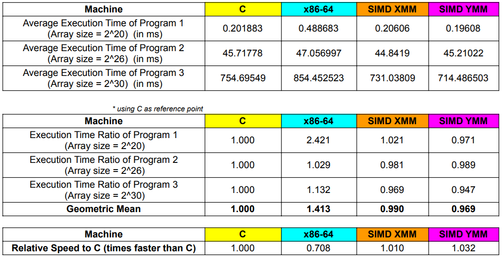
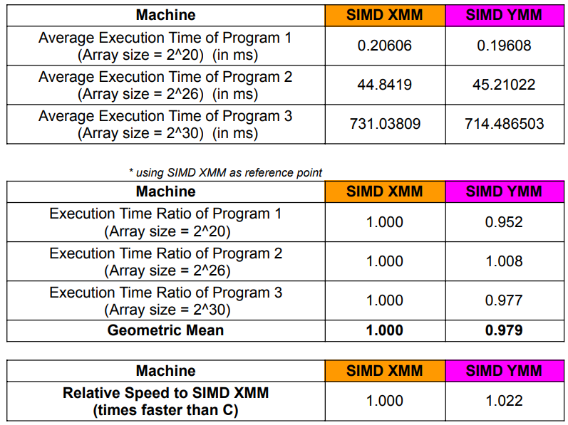

# SIMD Programming Project
Members: Guillermo, Ty, Ughoc

CSC612M G03

## Introduction

## Program Overview
* Write the kernel in (1) C program; (2) an x86-64 assembly language; (3) x86-64 SIMD AVX2 assembly language using XMM register; (4) x86-64 SIMD AVX2 assembly language using YMM register. The kernel is to perform vector triad for vectors B C, D and place the result in vector A. For each kernel version, time the process for vector size n = {2^(20), 2^(26), and 2^(30)}

* Input: Scalar variable n (integer) contains the length of the vector; Vectors B, C and D are single-precision float.
    * ***Input Initialization***: Arrays B, C, and D were initialized using trigonometric functions (sin, cos, tan) as shown below:
    
       
* Process: A[i] = B[i] + C [i] * D[i]

* Output: store the result in vector A. Display the first 5 and the last 5 elements of vector A for verification.

## Program output with Execution Time and Correctness Check
### Debug Mode
* 2^20

   

  
* 2^26

   

  
* 2^30

   

### Release Mode
* 2^20

   

  
* 2^26

   

  
* 2^30

   

## Boundary Check
- XMM
   

   `rax` takes in `rcx`, which contains the total amount of elements in the array. `shr rcx, 2` divides the array into groups of 4. The boundary checking comes from `and rax, 3`, which gets the remainder of the array size divided by 4 (rax % 4) so that the program can compute for the remaining items later on.

  

   This part of the program calculates for the result one element at a time instead of doing it 4 at a time, looping for a maximum of 3 times. 
   
- YMM
   A similar process can be done for YMM.
      
   

   `rax` takes in `rcx`, which contains the total amount of elements in the array. `shr rcx, 3` divides the array into groups of 8. The boundary checking comes from `and rax, 7`, which gets the remainder of the array size divided by 8 (rax % 8) so that the program can compute for the remaining items later on.

  

  This part of the program calculates for the result one element at a time instead of doing it 8 at a time, looping for a maximum of 7 times. 

## Summary Table of Execution Time and Comparative Result
### Debug

   

### Release

   

### SIMD Speed-up(XMM vs YMM)
   * Debug
     
      
   * Release
     
      
