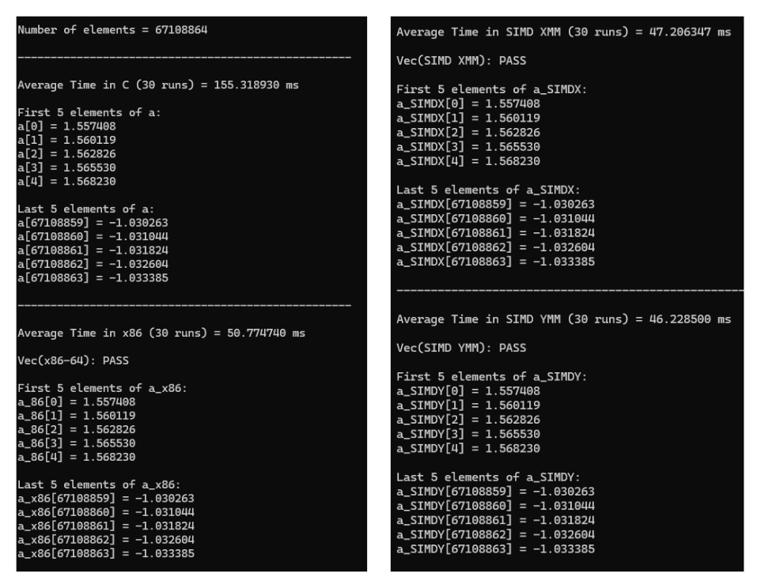
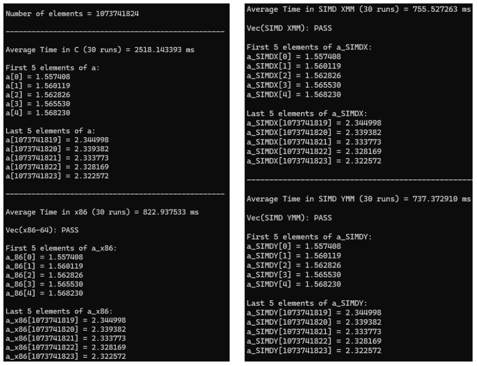
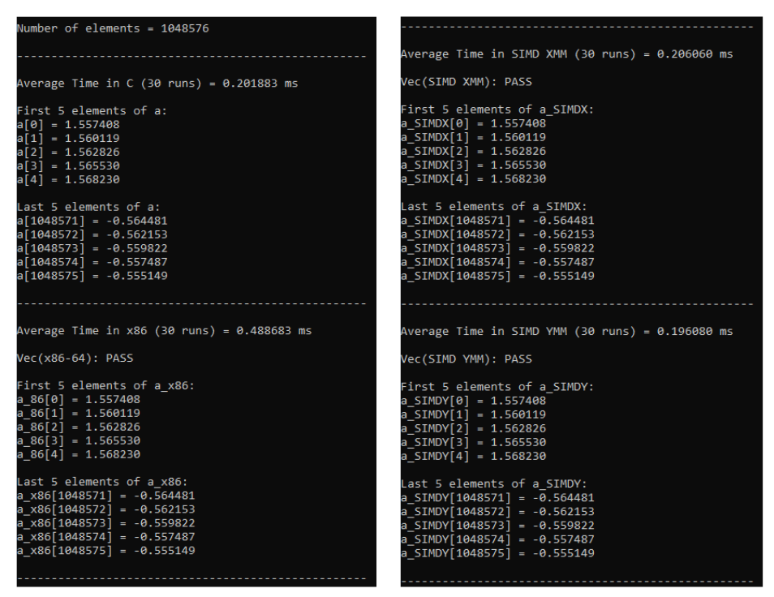
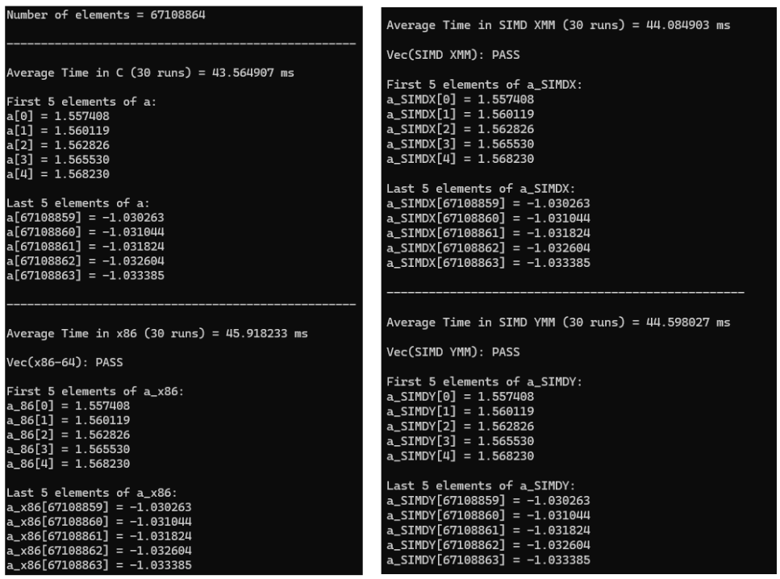
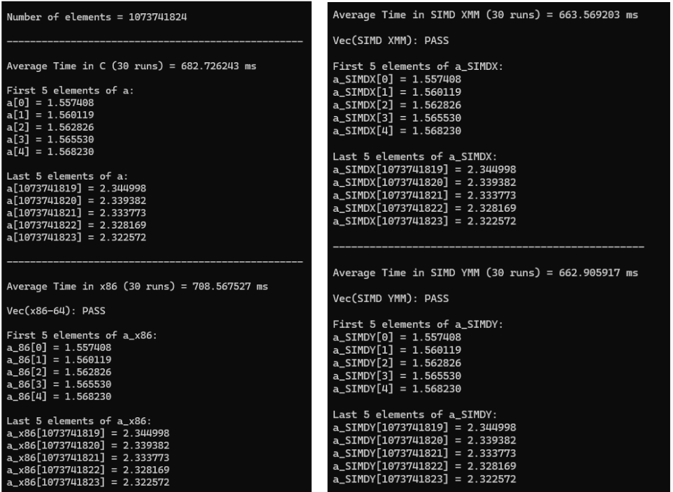
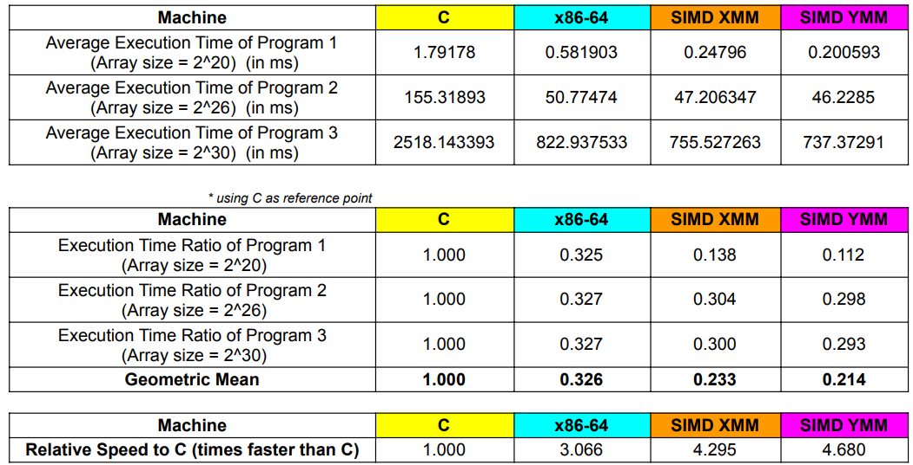
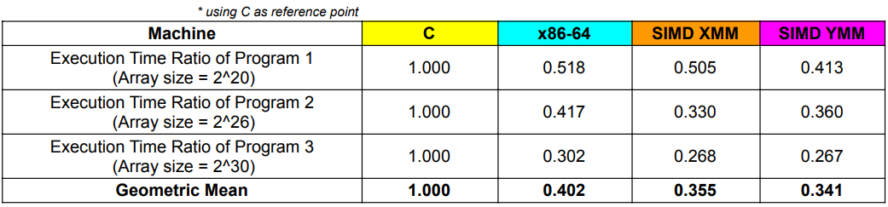
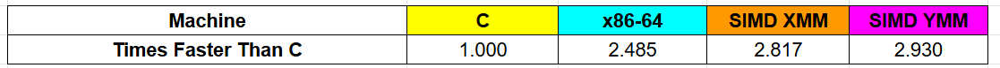
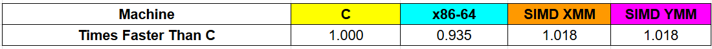

# SIMD Programming Project
Members: Guillermo, Ty, Ughoc

CSC612M G03

## Introduction

## Program Overview
* Write the kernel in (1) C program; (2) an x86-64 assembly language; (3) x86-64 SIMD AVX2 assembly language using XMM register; (4) x86-64 SIMD AVX2 assembly language using YMM register. The kernel is to perform vector triad for vectors B C, D and place the result in vector A.

* Input: Scalar variable n (integer) contains the length of the vector; Vectors B, C and D are single-precision float.
    * ***Input Initialization***: Arrays B, C, and D were initialized using trigonometric functions (sin, cos, tan) as shown below:
    
       
* Process: A[i] = B[i] + C [i] * D[i]

* Output: store the result in vector A. Display the first 5 and the last 5 elements of vector A for verification.

## Program output with Execution Time and Correctness Check
### Debug Mode
* 2^20

   

  
* 2^26

   

  
* 2^30

   

### Release Mode
* 2^20

   

  
* 2^26

   

  
* 2^30

   

## Boundary Check
TODO: add here screenshots for XMM and YMM boundary checks and show that it works indeed; add explantion for the logic 
- XMM
- YMM

## Summary Table of Execution Time and Comparative Result
### Debug

   

   

   

### Release

   

   

   
